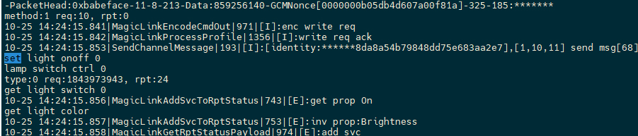
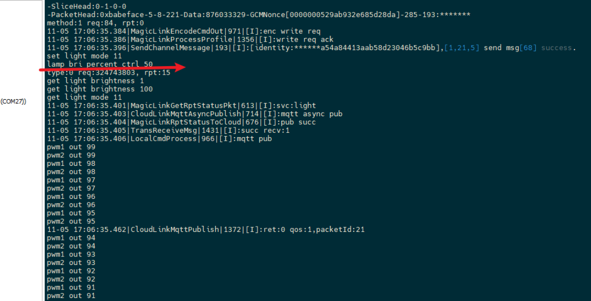

[toc] 

#### **多开线程后没有扫描到设备**

解决方案我有一个能够扫描到设备的固件，可以看一下不同固件的日志，分析一下在哪个流程中出现了问题这样就可以解决这种问题
##### 结果
当时是这个profile出现了问题，多了个\0,

profile修改后就好了。

#### **现有的key 线程突然停下来了也不检测了？**
按钮的问题出在灯光线程上，灯光线程是有问题的。灯光线程第一秒就被删除了实际上都没怎么运行。
闪一下
代码绝对有问题
key 不是很灵敏 我感觉是有一个cnt 进行读和计时的
找到了这个cnt
问题一， 控制函数都是0

查看参数传递 控制函数必须有两个参数，一个data，一个len

##### 结果 
是key的状态读取函数出了问题，我确实缺乏对这个按键库的了解，还是要多看代码，然后再定位问题。
按钮反应过长可能是渐变时间太长了，感觉整个渐变时间在两秒钟左右有了。

#### 删除提醒的功能

找到删除配网的位置

##### 结果
原有的库设计了方案，我一直逃避这个flash，后面花时间把flash的移植完成了。
#### **调光曲线的问题**

现在是非线性调光，50对应的是20 这个很不合理。
1 调光为什么要有步长这种概念？

##### 结果

#### **程序pwm低频率会卡死**

|pwm频率|是否卡死|
|--|--|
|4000|卡死|
|100000|流畅|
|50000|流畅|
|25000|流畅|
|10000|流畅|

结论是：大于10000都是流畅的